# Evidence Monitoring Agent

A local, spec-driven proof-of-concept that monitors how public large language models (LLMs)
represent AbbVie therapies versus competitors when asked realistic prospect, patient, and
provider questions. It **only captures and scores** — it never gives medical advice, contacts
anyone, or takes any outward action — and a **human approves every question before it is ever
submitted** to an LLM. The output is a queryable record of what each model said, an explainable
score for each response, threshold-based alerts on concerning answers, and a simple dashboard for
Medical Affairs and Commercial.

## Status

**Design complete · build in progress.** This project is **spec-first**: the specification,
plan, data model, and task breakdown were written and reviewed before any application code. It
**runs locally** — Claude (via the Anthropic API) acts as both the orchestrator and the scorer,
with all model ids sourced from config. Amazon Bedrock is the documented production swap.

➡️ Living status, phase roadmap, and decisions log: **[docs/project-status.md](docs/project-status.md)**

## Capabilities

- **Question Repository (approval gate)** — a versioned bank of generic, no-PII questions.
  Medical Affairs moves each question `PENDING → APPROVED → REJECTED`; only **APPROVED** questions
  are ever submitted.
- **LLM Response Agent** — a scheduled, unattended run that submits every approved question to
  every configured target, retries transient failures, and records every answer.
- **Immutable Response Repository** — every response is stored once, full text unedited, with a
  status of `SUCCESS / FAILED / TRUNCATED / BLOCKED` and full metadata; records are queryable.
- **Scoring + Alerts** — Claude produces a structured score per response; deterministic code
  decides which responses raise an alert.
- **Combined Reports + Approvals UI** — one local-only app: read-only Reports for stakeholders and
  read-write Approvals for Medical Affairs.
- **Scheduling + Audit** — a daily run on a cron/scheduler, plus an append-only audit log of every
  query and response for compliance.

## Scope

**In scope (POC):**
- The **4 core components**: Question Repository, LLM Response Agent, Response Repository, Scoring
  & Alerting.
- **3 public LLMs** — OpenAI GPT-4o, Google Gemini, and Anthropic Claude (queried as an end-user)
  — **plus a conditional Open Evidence** target used only for Provider-persona questions and only
  if API access is confirmed.
- The **162-question bank** (Patient 59 · Prospect 49 · Provider 54; across Immunology,
  Neuroscience, and Oncology).
- **Local execution** — SQLite/DuckDB storage, a self-contained HTML dashboard, no cloud services.

**Out of scope (POC):** any private/internal model; production data-platform integrations (Veeva,
Salesforce, data lake); real-time notification pipelines; user auth / RBAC / multi-tenant; mobile
apps. The broader **GEO / multi-agent / literature-mining / pharmacovigilance** vision is **future
direction, not POC scope**.

## The Constitution (11 principles)

The project is governed by [`.specify/memory/constitution.md`](.specify/memory/constitution.md).
In brief:

1. **Human approves, system suggests** — only APPROVED questions are submitted; scores/alerts are advisory.
2. **Immutable & auditable** — responses are write-once; scores are a separate versioned record; every call is audit-logged.
3. **No PII/PHI** — questions are generic; no personal data is stored anywhere.
4. **Content-agnostic code** — drug/competitor/indication names live only in the question bank and config, never in code.
5. **Config-driven targets** — adding/removing an LLM is a config + adapter change; model ids are never hard-coded.
6. **Terms of service & data residency** — comply with each provider's ToS; store responses only in local, controlled storage.
7. **Explain the score** — every score carries detected brands, up to five key claims, and a rationale.
8. **LLM scores, code decides** — Claude produces the score; deterministic code decides alerts.
9. **Resilient & resumable** — retry with backoff, mark FAILED after the budget, resume from the last completed question; target ≥95% capture.
10. **Built to grow into production** — externals sit behind clean `llm` and `data_access` seams that swap to Bedrock/Aurora by config.
11. **Quality is testable** — unit/component/e2e tests; ≥70% coverage on core; capture-rate and scoring schema are checked automatically.

## Diagrams

All diagrams live in [`docs/diagrams/`](docs/diagrams/).

| Diagram | What it shows |
|---------|---------------|
| `evidence_monitor_system_context` | The system in context: stakeholders, the agent, and the external LLM targets. |
| `evidence_monitor_detailed_pipeline` | End-to-end pipeline from approved question to scored, alerted, dashboarded result. |
| `evidence_monitor_module_architecture` *(planned — not yet in repo)* | Package/module map and the `llm` / `data_access` seams. |
| `orchestrator_detailed_langgraph_graph` | The explicit LangGraph orchestration graph (no autonomous loops). |
| `per_question_dispatch_four_outcomes` | Per-question dispatch and the four capture outcomes (SUCCESS/FAILED/TRUNCATED/BLOCKED). |
| `detailed_daily_run_sequence` | The daily run as a sequence: load → dispatch → persist → score → alert → summarize. |
| `scoring_and_alert_decision_flow` | How a structured score becomes a deterministic alert decision. |
| `evidence_monitor_detailed_erd` | Entity-relationship model (Question, LLM_Target, Run, Response, Scoring_Record, Alert, Audit_Log). |
| `evidence_monitor_local_execution_view` | How the pieces run together on a single local machine. |

System context:



Pipeline:



Scoring & alert decision flow:



> The ERD is an interactive HTML file: [`docs/diagrams/evidence_monitor_detailed_erd.html`](docs/diagrams/evidence_monitor_detailed_erd.html).

## How a run works

1. **Select** — load every question that is both `APPROVED` and active from the Question Repository.
2. **Dispatch** — for each question, submit it once to every configured target (Open Evidence only
   for Provider questions, if enabled). Transient failures retry with exponential backoff
   (3 attempts: 2s/4s/8s); after the budget the record is marked `FAILED` and the run continues.
3. **Persist** — store each answer as an immutable Response with full text, metadata, and status.
4. **Score** — Claude scores each response into a structured, versioned Scoring Record.
5. **Evaluate** — deterministic rules decide which responses raise an Alert.
6. **Summarize** — render the dashboard, write CSV/JSON exports, and produce a run summary.

Every step is checkpointed, so an interrupted run **resumes from the last completed question**
without re-submitting. Every external call is written to an **append-only audit log**.

## How scoring & alerts work

For each response, Claude returns a structured object (validated against a JSON schema):

- `sentiment_score` — `−1.0 … +1.0` toward the AbbVie therapy.
- `competitive_position` — `FIRST_LINE_RECOMMENDED | AMONG_OPTIONS | SECOND_LINE | NOT_RECOMMENDED | NOT_MENTIONED`.
- `citation_status` — `CITED | PARTIAL | ABSENT | WRONG_INDICATION`, where **WRONG_INDICATION**
  means the model returned content for the **wrong disease/indication** (a person routed to
  wrong-disease information).
- `brand_mentions` — the brands detected in the response.
- `key_claims` — up to five key claims the model made.
- `scoring_rationale` — a short explanation of the score.

**Code** (not the model) then applies **four deterministic alert rules**:

1. `sentiment_score` below the negative threshold (default **−0.3**, configurable).
2. `competitive_position` is `NOT_RECOMMENDED`.
3. A competitor brand has sentiment **≥0.3 higher** than the AbbVie therapy in the same response.
4. `citation_status` is `WRONG_INDICATION` → **highest-severity** alert.

## Tech stack

- **Python 3.11+**, managed with **uv**. **ruff** (format/lint), **pytest** (tests), **Pydantic** (schemas).
- **FastAPI** for the local Reports + Approvals app.
- **LangGraph** for the explicit, code-defined orchestration graph (no autonomous agent loops).
- **Anthropic API (Claude)** as orchestrator + scorer; **OpenAI** and **Google GenAI** SDKs for the
  monitored targets.
- **SQLite / DuckDB** behind a `data_access` interface. **APScheduler** (cron-compatible) for scheduling.
- Local-first: **no AWS services in the POC**.

## Repository guide

```text
.
├── README.md                     # You are here
├── CLAUDE.md                     # Golden rules + stack for Claude Code (agent context)
├── data/
│   └── question_bank.csv         # The 162-question bank (the ONLY place brand/competitor names live)
├── docs/
│   ├── SRS.pdf                   # Software Requirements Specification (source of scope)
│   ├── technical-architecture.md # Architecture, invariants, data model, ADR index, prod swap
│   ├── project-status.md         # LIVING status: phases, decisions, open items, how to resume
│   ├── adr/                      # Architecture Decision Records (0001–0006)
│   └── diagrams/                 # System, pipeline, orchestrator, ERD, sequence, etc.
├── specs/001-evidence-monitoring-poc/
│   ├── spec.md  plan.md  research.md  data-model.md  tasks.md  quickstart.md
│   ├── contracts/                # REST API, CLI, LLM adapter, scoring schema, data-access
│   └── checklists/requirements.md
├── src/evidence_monitor/         # Package code (built per tasks.md)
│   ├── config/ data_access/ llm/ question_repo/ response_repo/
│   ├── scoring/ alerts/ orchestrator/ dashboard/ observability/
│   ├── scheduler.py  cli.py  api.py
└── .specify/memory/constitution.md
```

## Claude Code setup

This repo is wired for [Claude Code](https://claude.com/claude-code):

- **Subagents** (`.claude/agents/`): `constitution-guardian` (checks staged changes against the 11
  principles), `test-runner`, `content-agnostic-auditor` (no hard-coded brands/secrets/PII),
  `data-explorer` (read-only DB/repo inspection).
- **Skills** (`.claude/skills/`): `/verify-phase`, `/add-llm-target`, `/import-question-bank`,
  `/capture-rate-eval`, `/scoring-schema-check` (plus the bundled `/speckit-*` workflow).
- **Hooks/permissions** (`.claude/settings.json`): a PostToolUse hook auto-runs `ruff format` +
  `ruff check --fix` on edited Python; read of `.env` is denied; `git push` and installs prompt.

## Spec-driven workflow

Built with **GitHub Spec Kit**. The chain — each step is a reviewed artifact:

```text
/speckit.constitution → /speckit.specify → /speckit.clarify → /speckit.plan
   → /speckit.tasks → /speckit.analyze → /speckit.checklist → /speckit.implement
```

Start from the constitution and spec; everything downstream traces back to them.

## How to run

> Build is in progress; the commands below reflect the planned CLI (see
> [`specs/.../contracts/cli.md`](specs/001-evidence-monitoring-poc/contracts/cli.md) and
> [`quickstart.md`](specs/001-evidence-monitoring-poc/quickstart.md)).

**Offline / mock (no API keys, no network):**
```bash
uv sync
uv run evidence-monitor health-check --mock
uv run evidence-monitor import-questions --file data/question_bank.csv
uv run evidence-monitor run --mock          # full capture → score → alert → dashboard, all mocked
uv run pytest -q                            # unit + component + e2e
```

> `uv sync` installs the runtime deps **and** the dev tooling (pytest, ruff): they live in the
> default `dev` dependency group, so `uv run pytest` / `uv run ruff` work with no `--extra` flag.

**Live:** put `ANTHROPIC_API_KEY`, `OPENAI_API_KEY`, `GOOGLE_API_KEY` (and optional
`OPEN_EVIDENCE_API_KEY`) in `.env`, approve questions in the Approvals UI, then:
```bash
uv run uvicorn evidence_monitor.api:app     # Reports + Approvals UI
uv run evidence-monitor run                 # a live run over APPROVED questions
```

## Roadmap

- **Now:** finish the POC build (per `tasks.md`) — capture & store → scoring → approval gate →
  alerts → dashboard.
- **Acceptance:** a 7-day unattended run with zero interventions, ≥95% capture, and a dashboard
  stakeholders confirm is actionable.
- **Production (future):** SQLite → Aurora/DynamoDB, Anthropic API → Bedrock, local scheduler →
  EventBridge, behind the same seams.
- **Vision (future, not POC):** GEO analysis, multi-agent architecture, literature-mining,
  pharmacovigilance signal detection.

## Data & compliance note

Questions are **generic and contain no PII/PHI**. Drug, competitor, and indication names exist
**only** in `data/question_bank.csv` and configuration — never in application code. Responses are
stored only in **local, controlled storage** and are never forwarded to third parties. The system
complies with each LLM provider's terms of service, every external call is **audit-logged**, and
**no question is submitted until a human has approved it**. Secrets are never logged.
